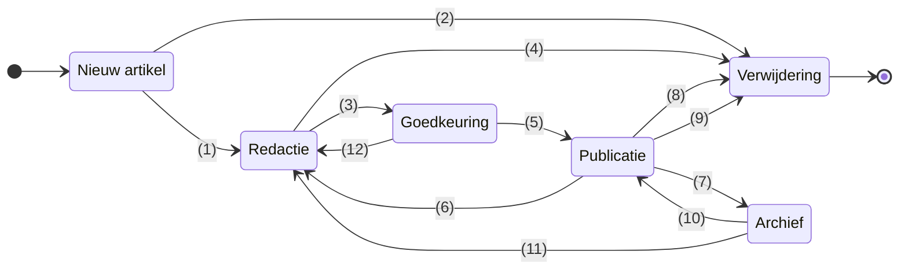

# Levenscyclus van een artikel

## Overzicht van de transities en statussen

::: warning
Het entry punt van die verantwoordelijk is voor de migratie van oudere versies van het woordenboek is niet opgenomen in dit documentaitie document. 
Omdat dit manueel word geregeld door een persoon die hiervoor is aangesteld. Bij vragen mtrent dit proces contacteer dan het kern team van het Vlaams woordenboek
:::

### 1. Nieuw artikel -> Redactie

- **Beschrijving:** Een nieuw artikel wordt ter redactie aangeboden
- **Gemachtigde rollen:** Redacteur, Eindredacteur, Administrator, Ontwikkelaar

## 2. Nieuw atikel -> Verwijdering 

- **Beschrijving:** Een nieuw artikel voorstel word ter verwijdering opgegeven 
- **Gemachtige rollen:** 
