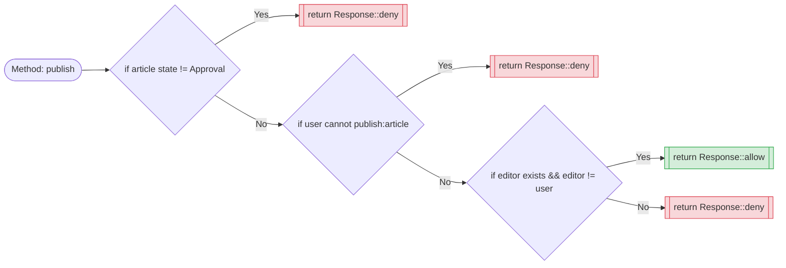
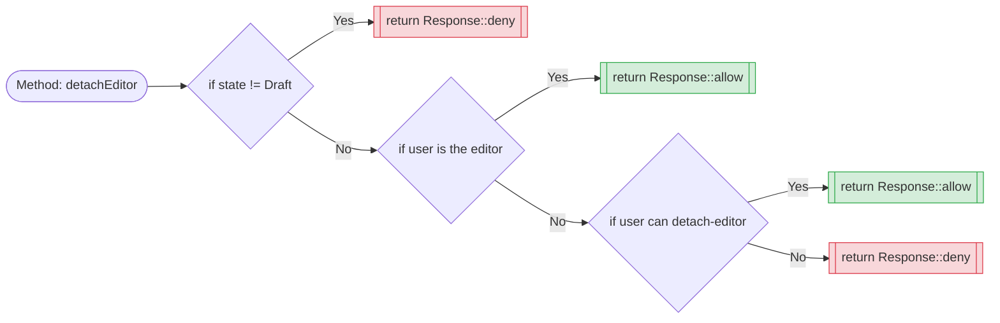
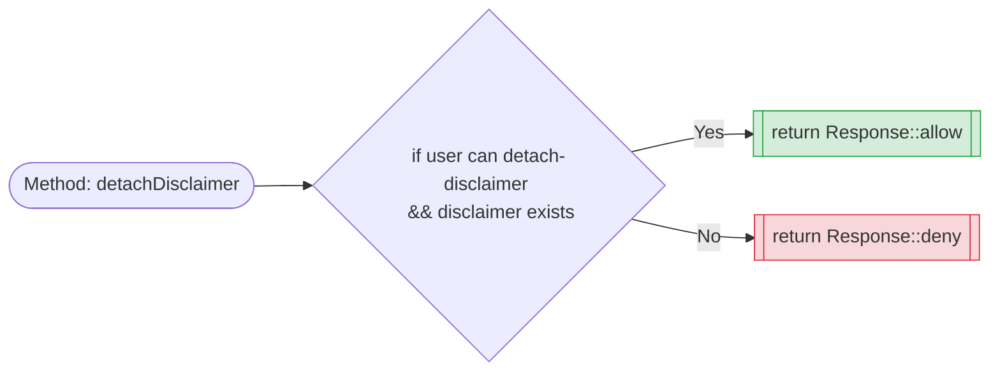
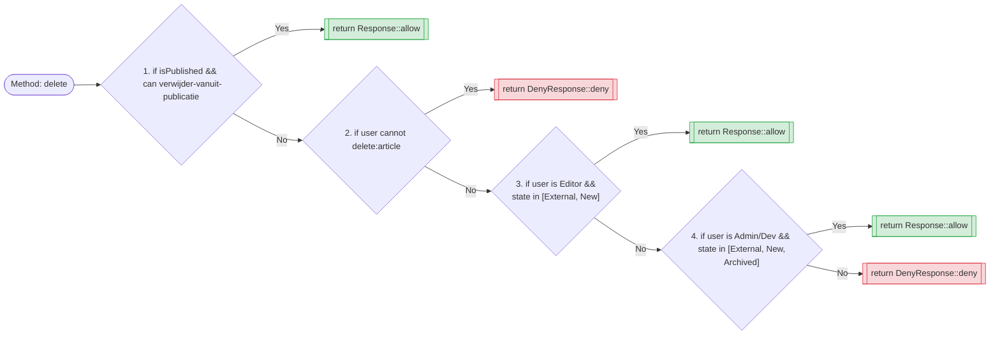
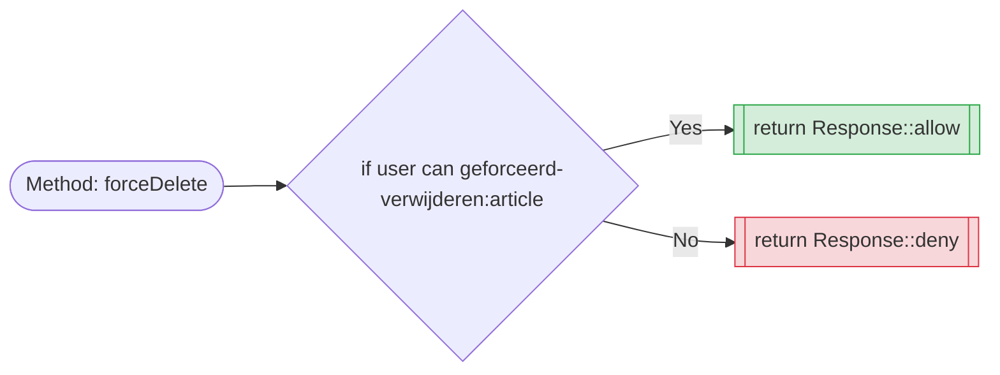

# Docoumentatie artikelen flow

> [!IMPORTANT]
> Dit document dient als een intern audit document voor de flow van woordenboek artikelen.

## Policies

### Policy: display *(artikelen weergeven)*

#### Logische analyse

De logica bepaalt de zichtbaarheid van een artikel op basis van de publicatiestatus en de specifieke rechten van de gebruiker. 
De kern hiervan is een balans tussen publieke toegankelijkheid en interne workflow inzage. 

- **Publieke toegang:** Artikelen die de status `Published` of `Archived` hebben zijn voor iedereen (of in ieder geval de doelgroep) zichtbaar. Dit is de "happy path" voor contentconsumptie. 
- **Interne toegang: (privileged):** gebruikers met `update`-rechten krijgen een ruimere blik. Zij kunnen artikelen zien die nog in de `Draft` of `Approval` fase zitten. 
- **Beveiligingsmechanisme:** In plaats van een generieke `Deny` (HTTP STATUS: 403), gebruikt de policy een `denyAsNotFound` (HTTP STATUS: 404). Dit is een bewuste keuze voor **[Security through obscurity](http://nl.wikipedia.org/wiki/Security_through_obscurity)**: 
  kwaadwillenden kunnen zo niet achterhalen of een artikel uberhaupt bestaat als ze niet de juiste rechten hebben.

---

### Policy: update (wijzigen van artikelen)

#### Logische analyse 

Deze policy is aanzienlijk strenger dan de `display` policy, omdat het hier gaat om data-integriteit. De logica volgt een hierarchie van beperkingen: 

1. **Harde blokkade (Trash):** Als een artikel in de prullenbak staat, is bewerken per definitie uitgesloten. Dit voorkomt conflicten en inconsistenties in de database. 
2. **Publicatie privilege:** Er wordt een expliciet onderscheid gemaakt tussen de algemene `update` permissie en de `update-published` permissie. 
   Alleen gebruikers met dit specifieke recht mogen content aanpassen die al live staat. 
3. **Locking mechanisme:** artikelen met de status `Published` of `Approval` als "gelock" beschouwd voor reguliere editors. 
   Dit waarborgt dat content die momenteel beoordeeld wordt of al live staat, niet zomaar gewijzigd kan worden zonder de juiste bevoegdheden. 
4. **Status-afhankelijke bewerking:** is voor niet-gepubliceerde content (zoals `New`, `Draft` of `Rejected`) is bewerken alleen toegestaan als de status in de `allowedStates`
   voorkomt en de gebruiker de algemene `update` permissie heeft.

---

### Policy: sendForApproval

#### Logische analyse 

Deze policy fungeert al de **poortwachter** voor de redactionele workflow. In tegenstelling tot de `update` policy, die 
breed kijkt naar diverse statussen, is deze methode zeer specifiek en restrictief: 

- **Status beperking:** De actie is uitsluitend toegestaan wanneer een artikel de status `Draft` heeft. 
  Dit voorkomt dat artikelen die al in `Approval` staan, of reeds `Published` zijn, opnieuw (en mogelijk redundant)
  in de wachtrij voor goedkeuring worden geplaatst.
- **Permissie validatie:** Naast de juiste status moet de gebruiker expliciet beschikken over de `send-for-approval` permissie. 
  Dit scheidt de redacteurs (die alleen draft mogen maken) van de eindredacteurs die het publicatieproces mogen initieren.
- **Workflow integriteit:** Door de `Check` strikt te houden, wordt gewaarborgd dat de staat van het artikel altijd voorspelbaar 
  blijft binnen de database transacties die volgen op deze policy check.

---

### Policy: unarchive *(Artikelen uit het archief halen)*

#### Logische analyse

De `unarchive` policy is een kritieke herstel-actie die content terugbrengt in de actieve workflow.
De logica is strikt om te voorkomen dat actieve of concept-artikelen per ongeluk in een verkeerde staat worden geforceerd:

- **Status exclusiviteit:** De actie is alleen toegestaan als het artikel zich momenteel in de `Archived` status bevindt. 
  Dit is een essentiele beveiliging; een artikel dat bijvoorbeeld in `Approval` staat, mag niet via deze methode "ge-unarchived" worden, 
  omdat dit de review logica zou omzeilen. 
- **Gespecialiseerde permissie:** er wordt gecontroleerd op de specifieke `unarchive:article` permissie. Dit is doorgaans een hogere permissie 
  dan een standaard `update`, omdat het heractiveren van oude content mogelijks juridische of redactionele gevolgen heeft (denk aan verouderde informatie die weer vindbaar wordt).
- **Binair resultaat:** Er is geen grijze zone of `NotFound` response nodig zoals bij de `display` policy. als het artikel kunt zien maar niet mag unarchiven, volgt een expliciete `deny`.

---

### Policy: publish *(Publiceren van artikelen)*

---

### Policy: unpublish **(Artikelen uit publicatie halen)**

---

### Policy: detachEditor

---

### Policy: attachDisclaimer

---

### Policy: detachDisclaimer

---

### Policy: archiveArticle

---

### Policy: delete

---

### Policy: restore

---

### Policy: restoreAny

---

### Policy: deleteAny

---

### Policy: forceDelete

---

### Policy: forceDeleteAny

