# Docoumentatie artikelen flow

> [!IMPORTANT]
> Dit document dient als een intern audit document voor de flow van woordenboek artikelen.

## Policies

### Policy: display *(artikelen weergeven)*

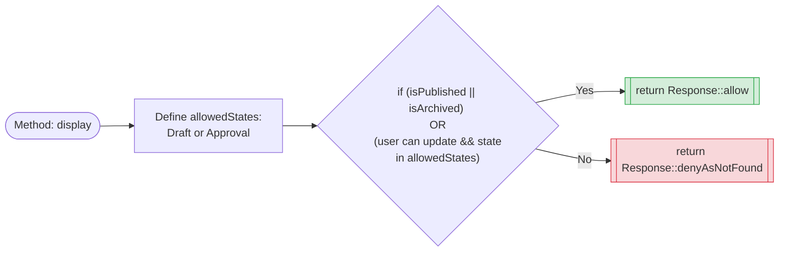

---

### Policy: update (wijzigen van artikelen)

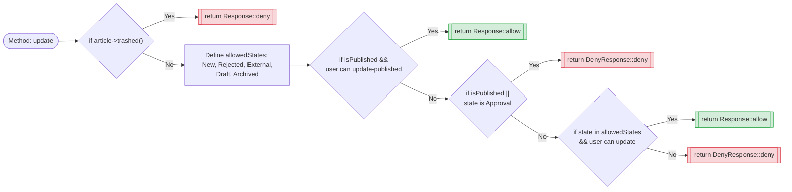

---

### Policy: sendForApproval

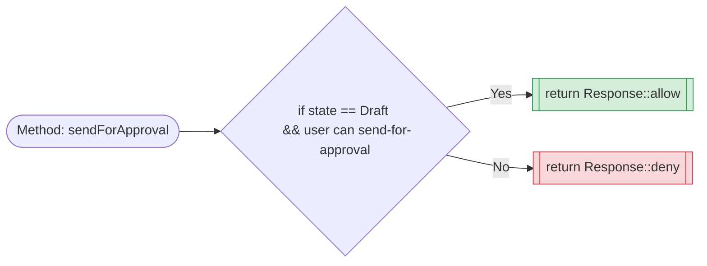

---

### Policy: unarchive *(Artikelen uit het archief halen)*

---

### Policy: publish *(Publiceren van artikelen)*

---

### Policy: unpublish **(Artikelen uit publicatie halen)**

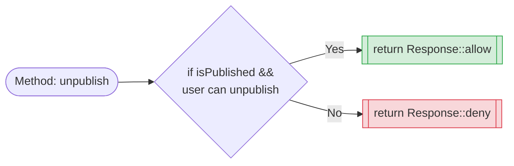

---

### Policy: detachEditor

---

### Policy: attachDisclaimer

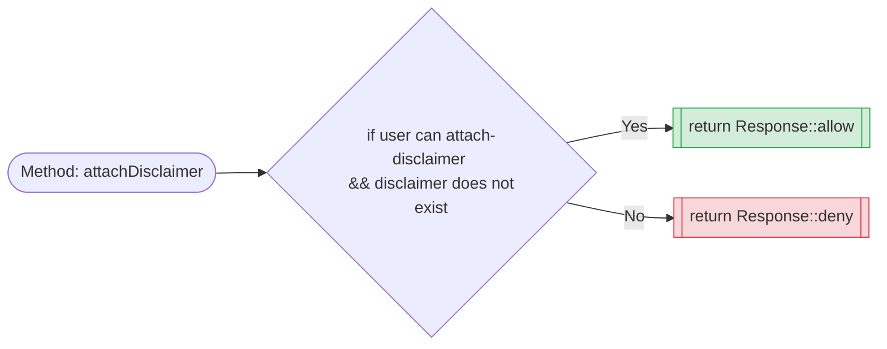

---

### Policy: detachDisclaimer

---

### Policy: archiveArticle

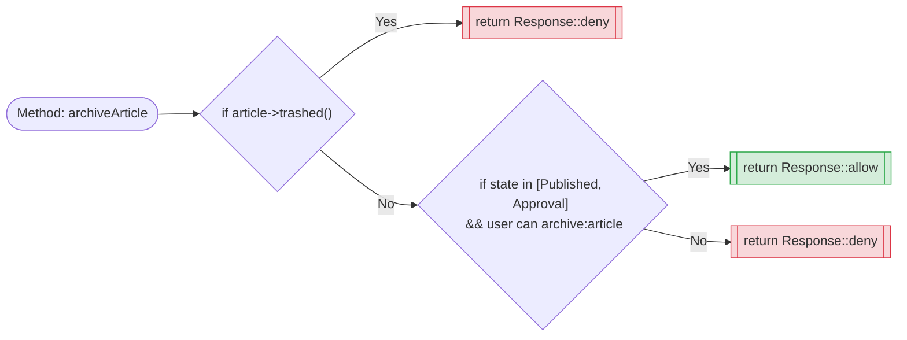

---

### Policy: unarchive

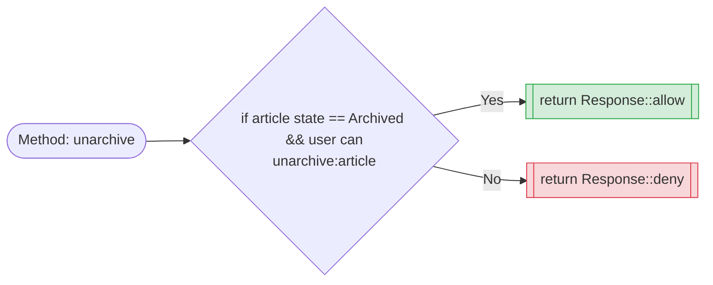

---

### Policy: delete

---

### Policy: restore

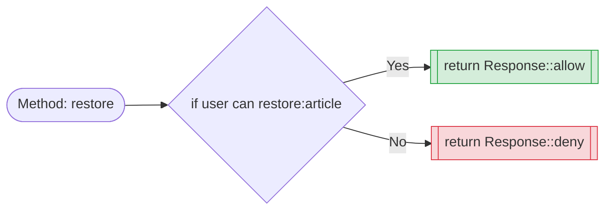

---

### Policy: restoreAny

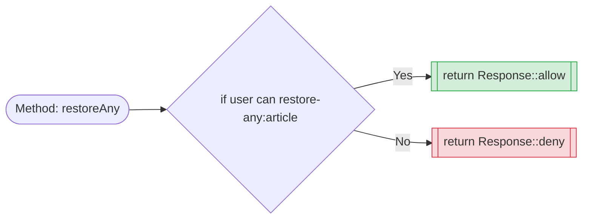

---

### Policy: deleteAny

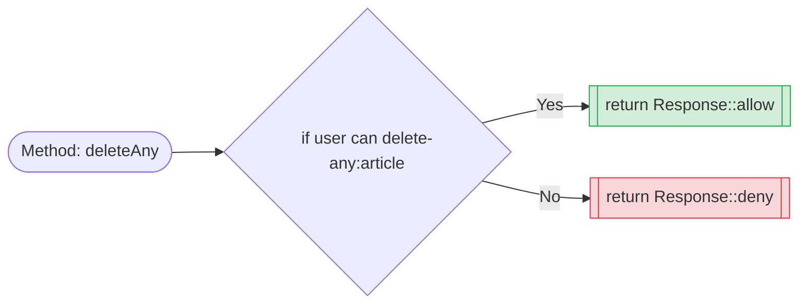

---

### Policy: forceDelete

---

### Policy: forceDeleteAny

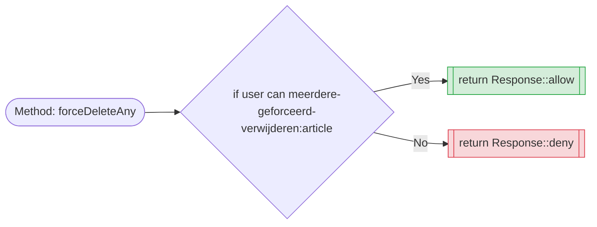

#### Gebruikersfeedback & foutafhandeling

| Scenario | Systeemtaal (Code) | Gebruikersmelding (UI) | Betekenis voor de gebruiker |
| :---- | :---- | :---- |
